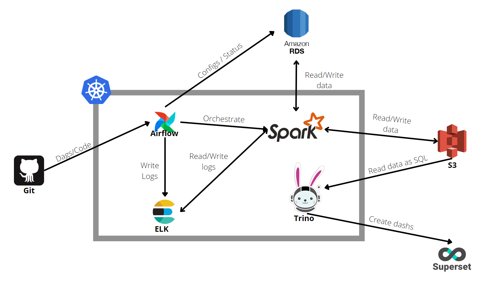

# Jobsity Challenge

The main goal it's to run a few data treatments to generate an automated pipeline and save it to a SQL database.

## Running

To run, you can use the ```makefile``` or you can run by yourself:

```bash
docker-compose run application python main.py
```

## Usage

There are two functions to run. 
If you want to run both functions, just run the command on top. 

To run just specific parts of the job, you can change a [params file](./app/params.py) (In production should be changed to a .env file), with the parameter ```pipeline```


```python
pipeline = "avg_data"
#or
pipeline = "ingest"
```

For the ingest, you asked me to group similar origin, destination, and time of day, but I was not sure about what is "similar". What I did it's to let you choose the number of decimal places into the params file.


## Parameters
There are other variables that you can change:

- path_trips_file - Path to the trips file
- conn_uri - Connection URI to your database
- table_db - Table for the trips treatments
- conn_uri - Connection URI to your database
- table_db - Table for the trips treatments
- table_db_agg - Table for the trips by week
- decimal_size_lat_long - Size of decimal places on lat/long, [check more on this link](http://wiki.gis.com/wiki/index.php/Decimal_degrees)
- p1 - First point for a boundary box on trips by week code
- p2 - Second point for a boundary box on trips by week code


## Scalability
Since we are using Spark, which is highly scalable, we are not going to have problems with 100 million lines. If needed you just have to add more machines to the cluster / docker image.

The only point that I would change, it's the SQL database. This one can reach it's limit, depending of the machine you have, but it was a must have into the coding challenge.


## Architecture on the cloud



We also can change the spark cluster into the kubernetes to an EMR service and the Presto for the Athena Service.


## Sql file - For questions

You can find the file [here](./sql_answers/answers.sql)


## Future enhancements

I would like to have more time to do this test, but what should i do if i have more time?

- Create tests
- Divide the files into classes with more responsability
- Create hooks for other applications
- Change the params file to an .env file
- Partitioning results
